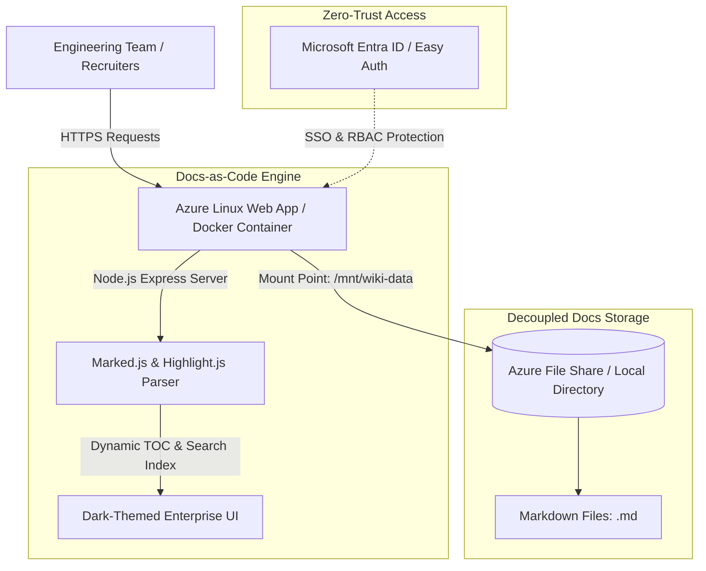

# 📚 DevSecOps Docs-as-Code & Wiki Knowledge Portal

[](https://nodejs.org)
[](https://expressjs.com)
[](https://docker.com)
[](https://terraform.io)
[](https://azure.microsoft.com)
[](LICENSE)

A lightweight, enterprise-grade **Docs-as-Code Knowledge & Wiki Portal** built with Node.js, Express, Markdown rendering, and Azure File Share storage. Serves as a unified single-pane-of-glass for engineering runbooks, architectural decision records (ADRs), and security SOPs.

---

## 📐 Architectural Overview



---

## ✨ Features & Capabilities

- 📝 **Docs-as-Code Workflow**: Statically parses `.md` markdown files directly from local storage or mounted **Azure File Shares** (`/mnt/wiki-data`).
- ⚡ **Real-Time Search & Table of Contents (TOC)**: Auto-generates document navigation, header links, and live full-text document search.
- 🎨 **Modern Dark-Themed UI**: Built-in syntax highlighting (via Highlight.js) for code blocks (Bash, Python, Terraform, YAML, K8s).
- 🐳 **1-Command Docker Setup**: Fully containerized with `docker-compose.yml` for instant local execution.
- ☁️ **Azure Cloud Native (IaC)**: Includes modular Terraform (`infra/`) to provision Linux Azure Web Apps, Storage Accounts, File Shares, and Azure Easy Auth integration.

---

## 📁 Repository Structure

```
devsecops-docs-as-code-portal/
├── README.md                           # Architecture Overview & Guide
├── docker-compose.yml                  # Local Docker Stack Definition
├── Dockerfile                          # Production Multi-Stage Dockerfile
├── .env.example                        # Environment Variables Configuration
├── wiki-data/                          # File-Based Markdown Documentation Store
│   ├── 01-architecture-overview.md
│   ├── 02-security-hardening-sop.md
│   └── 03-incident-response-runbook.md
├── app/
│   ├── server.js                       # Express Backend with Markdown Parser Engine
│   ├── package.json                    # Node.js Dependencies
│   └── public/                         # Frontend Static Assets (HTML/CSS/JS)
├── infra/                              # Infrastructure as Code (IaC)
│   ├── main.tf                         # Azure Resource Group, Web App & File Share Mount
│   ├── variables.tf
│   └── outputs.tf
└── .github/
    └── workflows/
        └── deploy.yml                  # GitHub Actions CI/CD Pipeline
```

---

## 🚀 Quickstart Guide

### 1. Local Testing with Docker Compose (Recommended)

Run the portal locally in **1 command**:

```bash
# 1. Clone repository & build container
docker-compose up --build -d

# 2. Open portal in browser:
# http://localhost:3000
```

### 2. Local Testing with Node.js

```bash
# Enter application directory
cd app

# Install dependencies
npm install

# Start development server
npm start
```

---

## ☁️ Azure Cloud Deployment (Terraform)

Provision the complete Azure environment (Linux Web App + Storage Account + File Share Mount) using Terraform:

```bash
cd infra

# Initialize Terraform modules
terraform init

# Plan infrastructure deployment
terraform plan

# Apply deployment
terraform apply -auto-approve
```

---

## 📄 License
Distributed under the **MIT License**. Free for public and commercial use.
